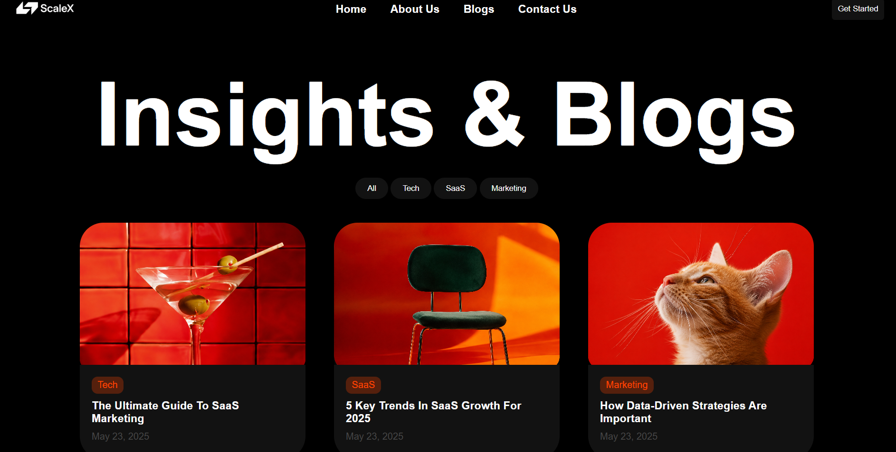
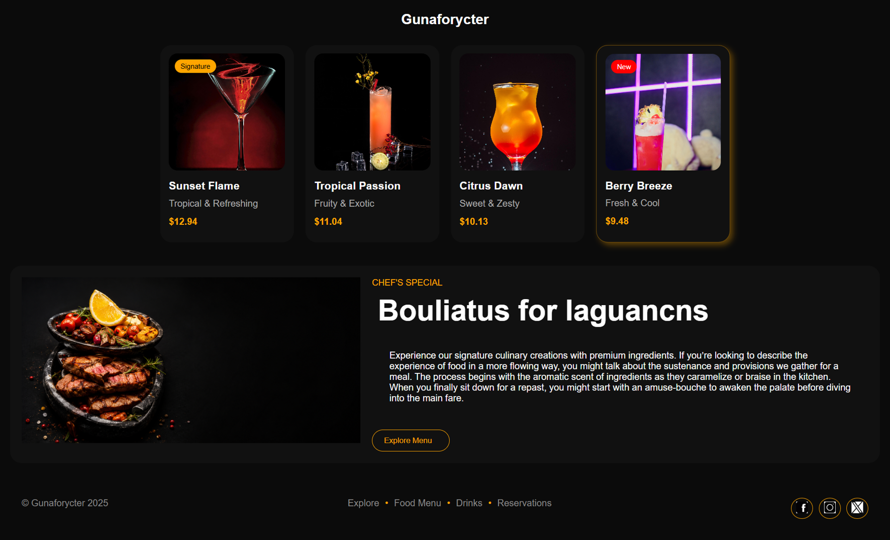
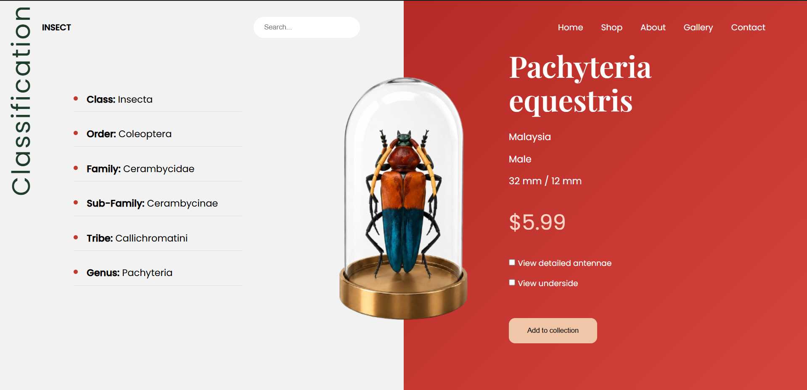

# 🎯 Assignment 2 – UI Designs using Flexbox & Position

## 📌 Overview

In this assignment, I recreated **three UI designs** using HTML and CSS.
The focus was on improving layout skills using **Flexbox** and **Position properties**.

---

## 🧩 Designs Included

### ✅ Design 1 (Easy)

* Built completely by myself
* Used Flexbox for layout
* Focused on spacing and alignment

### ✅ Design 2 (Medium)

* Built completely by myself
* Used Flexbox + Position (relative & absolute)
* Worked on card layout, hover effects, and UI structure

### 🤖 Design 3 (Hard – Insect Design)

* Built with some AI guidance
* Helped me understand complex layout structure
* Learned better positioning and UI breakdown

---

## 🛠️ Technologies Used

* HTML5
* CSS3
* Flexbox
* Position (relative & absolute)

---

## 📸 Screenshots

(Add your screenshots here)

Example:

* 
* 
* 

---

## 📚 What I Learned

* How to structure real UI layouts
* Better understanding of Flexbox
* Positioning elements using CSS
* Improving UI accuracy by observing designs

---

## 🚀 Conclusion

This assignment helped me improve my frontend skills and understand how real-world UI designs are built.
